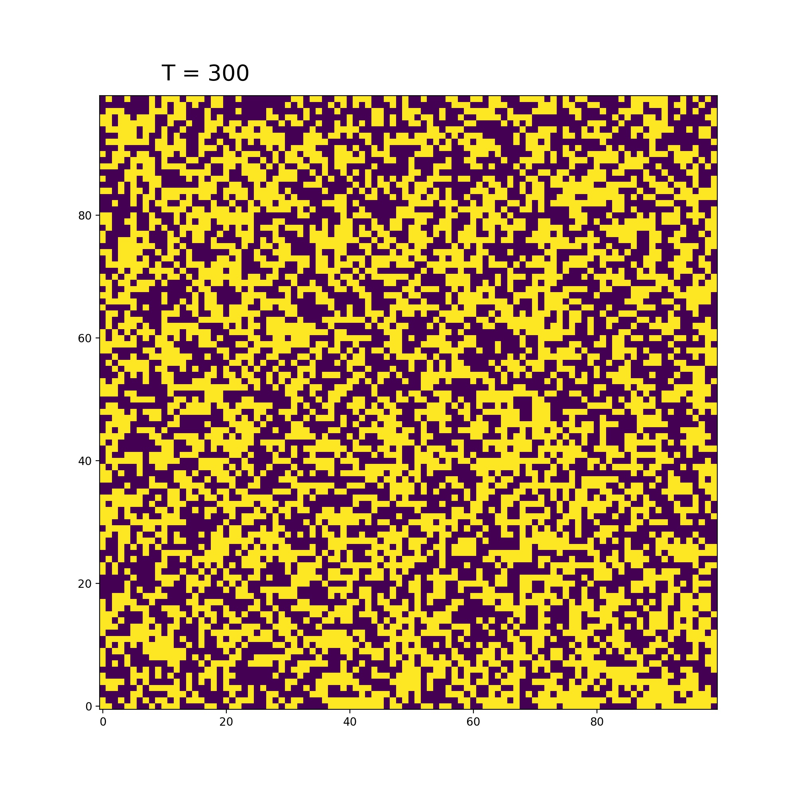
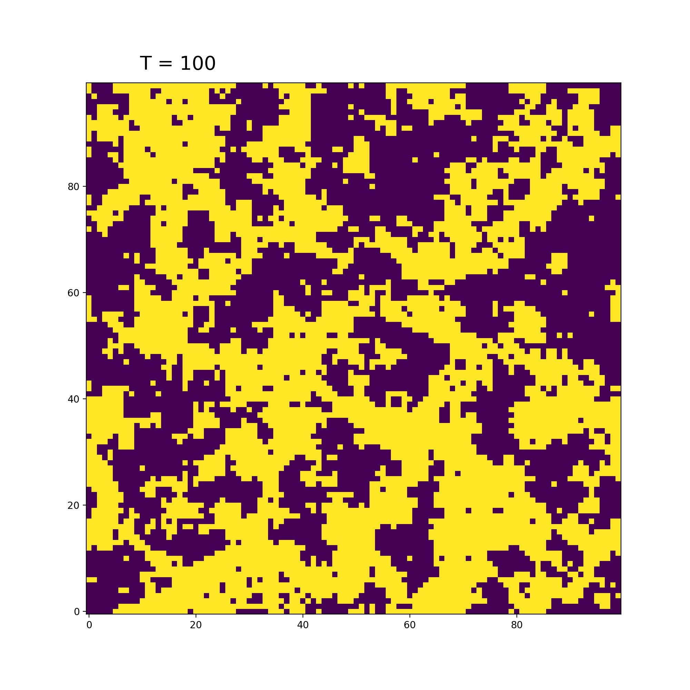
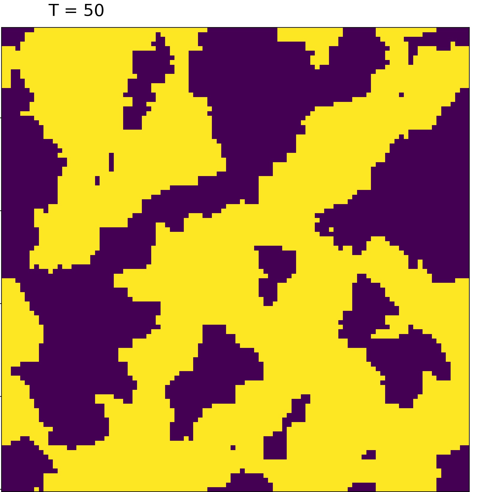
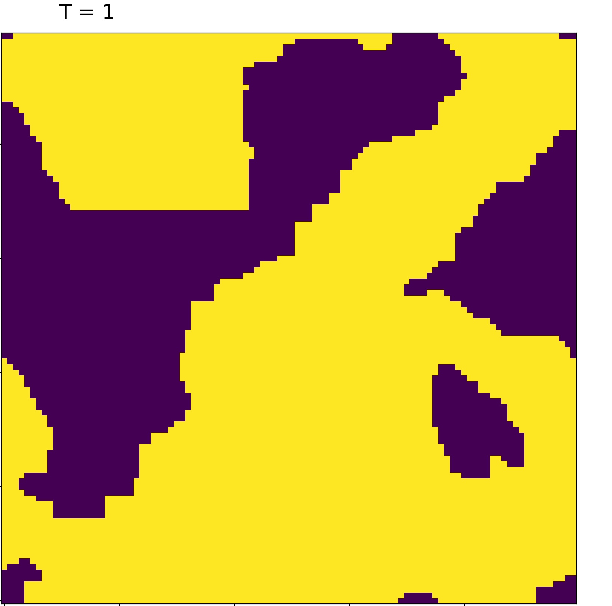

# Kinetic Modeling
This repo contains a few sample projects that demonstrate some of the modeling used in material science.
## Chemical Reaction Network
**Stochastic Solution for coupled differential equations**
The Chemical Reactiion Network solves problems of the form

$$
\begin{aligned}
\frac{d}{dt} N_1 &= -k_1 N_1 \\
\frac{d}{dt} N_2 &= k_1 N_1 - k_2 N_2\\
\frac{d}{dt} N_3 &= k_2 N_2 - k_3 N_3\\
\vdots
\end{aligned}
$$

In this example the chemical reaction network is used to simulate a 1D many atom random walk.
All the mobile atoms start in the same deep minimum and are then allowed to migrate away facing a series of shallow and deep minimum with correspondig low and high activation barriers.
This simulation was used <a href="https://www.nature.com/articles/s43246-023-00347-6">Hydrogen-induced degradation dynamics in silicon heterojunction solar cells via machine learning</a> to model the kinetics of hydrogen atoms in amorphous Si.
## PN Junction
**Finite Element Method**
This example simulates the diffusion of electrons and holes in a 2D PN junction via Fick's law

$$
    J = -D \frac{d}{dn} \rho
$$

This was a side project and it was used for some experimental techniques where intermidiate states were saved to textures in an attempt to utilize some of the more unique features of gpu memory.
### Dependencies
    - GLFW > 3.3
    - OpenCL 1.2
    - OpenGL > 3.3

## Ising
**Markov Cahin Monte Carlo**

This is a simple python script that computes the magnetic ordering of an Ising spin lattice with ferromagnetic coupling.

    
    
    
    

